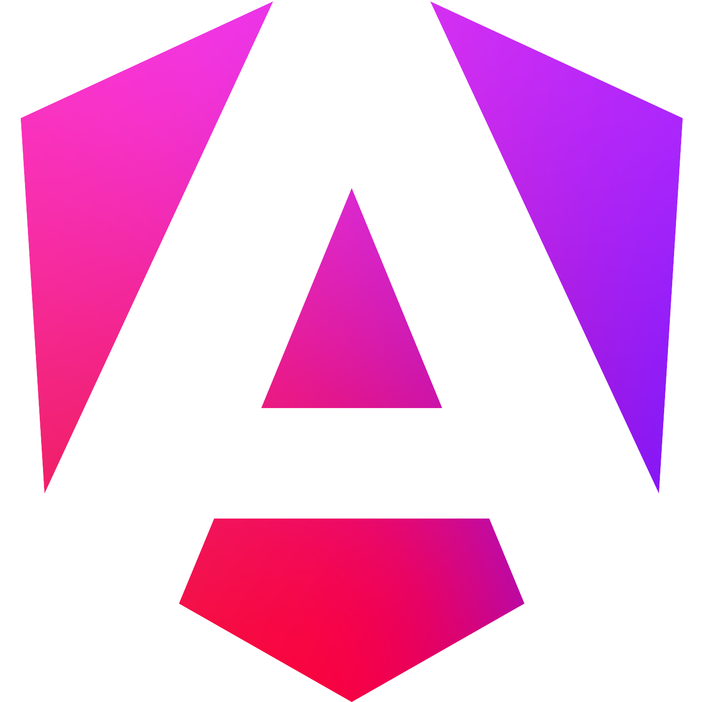

<p align="center">
  <a href="https://www.typescriptlang.org/" target="blank"></a>
  <a href="https://taiga-ui.dev/" target="blank"></a>
  <a href="https://angular.dev/" target="blank"></a>
  <a href="https://tailwindcss.com/" target="blank"></a>
   <a href="https://playwright.dev/" target="blank"></a>
</p>

<h1 align="Center">HiveMind Frontend</h1>

This repository contains the source code for the HiveMind client application, developed as part of a student project for the Web Technologies course in the Computer Science degree program at the University of Naples Federico II.

It is a responsive, progressive web application which can be used on many different browsers and devices and even installed. It also allows users to personalize their experience by offering multiple themes to choose from.

## Build instructions

To build the application in production mode, and serve it on `http://localhost:3000/`, run one of the following commands:

```bash
# without compressing
npm run build-and-serve

# compress to gzip
npm run build-and-serve:gzip
```

To start a local development server, hosted on `http://localhost:4200/`, run:

```bash
npm start
```

\*note: The application will only be installable as a PWA on some browsers if built and served in production mode

## Technologies

- The **[TypeScript](https://www.typescriptlang.org/)** programming language and the **[Angular (v19)](https://angular.dev/)** framework were used for the development of the application.

- The **[Taiga UI](https://taiga-ui.dev/)** library was used for its many pre-built components

- The **[TailwindCSS](https://tailwindcss.com/)** CSS framework was used for most of the styles

- **[Playwright](https://playwright.dev/)** was used to implement E2E tests.

- Other important packages used for the project include **[rxjs](https://rxjs.dev/)**, **[ts-cacheable](https://www.npmjs.com/package/ts-cacheable)** and **[lodash-es](https://www.npmjs.com/package/lodash-es)**

## Other credits

- SVG icons used in the UI are offered by **[Lucide](https://lucide.dev/)**

- Brain svg icon used in logo, favicon and icon is offered by by Saputra from **[Noun Project](https://thenounproject.com/browse/icons/term/brain/)** (CC BY 3.0)

- Modeseven-L3n5 font is offered by Andrew Bulhak from **[fontspace.com](https://www.fontspace.com/modeseven-font-f2369)** under a Freeware license
